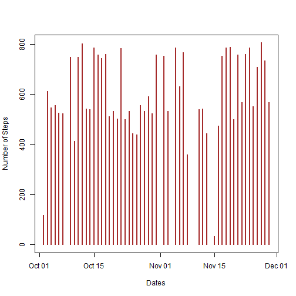
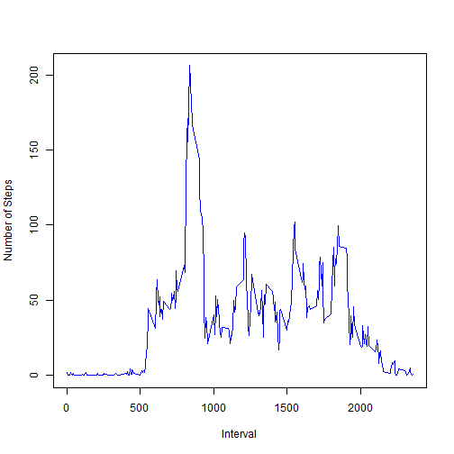
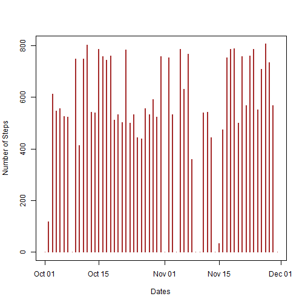
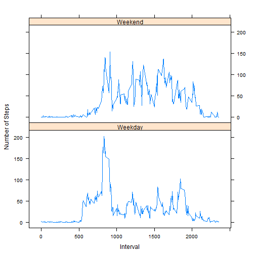

Peer Assessment 1
========================================================

Note - The template follows question pattern for ease of use.

### Steps Required:


#### Loading and preprocessing the data


1.Load the data.


```r
ds <- read.table("activity.csv", sep=",", header=TRUE)
```

*Description - ds is the data set. Here the csv file is assumed to be in the working folder. The columns are
1.Steps
2.Date
3.Interval
The column numbers are used in most of the code to avoid spelling errors*


2.Process/transform the data (if necessary) into a format suitable for your analysis


```r
ds$date<-as.Date(ds$date)
ds1<-ds[complete.cases(ds),]
```

*Description - ds1 now contains only required cases and with proper data types in all columns.*


#### What is mean total number of steps taken per day?


1.Make a histogram of the total number of steps taken each day


```r
plot(ds1[,2], ds1[,1], type="h", xlab="Dates", ylab="Number of Steps", lwd = 2, col = "brown")
```

 


2.Calculate and report the mean and median total number of steps taken per day


```r
library(plyr)
ddply(ds1, ~date, summarise, Steps_Mean =mean(steps), Steps_Median = median(steps), Steps_Total = sum(steps))
```

```
##          date Steps_Mean Steps_Median Steps_Total
## 1  2012-10-02     0.4375            0         126
## 2  2012-10-03    39.4167            0       11352
## 3  2012-10-04    42.0694            0       12116
## 4  2012-10-05    46.1597            0       13294
## 5  2012-10-06    53.5417            0       15420
## 6  2012-10-07    38.2465            0       11015
## 7  2012-10-09    44.4826            0       12811
## 8  2012-10-10    34.3750            0        9900
## 9  2012-10-11    35.7778            0       10304
## 10 2012-10-12    60.3542            0       17382
## 11 2012-10-13    43.1458            0       12426
## 12 2012-10-14    52.4236            0       15098
## 13 2012-10-15    35.2049            0       10139
## 14 2012-10-16    52.3750            0       15084
## 15 2012-10-17    46.7083            0       13452
## 16 2012-10-18    34.9167            0       10056
## 17 2012-10-19    41.0729            0       11829
## 18 2012-10-20    36.0938            0       10395
## 19 2012-10-21    30.6285            0        8821
## 20 2012-10-22    46.7361            0       13460
## 21 2012-10-23    30.9653            0        8918
## 22 2012-10-24    29.0104            0        8355
## 23 2012-10-25     8.6528            0        2492
## 24 2012-10-26    23.5347            0        6778
## 25 2012-10-27    35.1354            0       10119
## 26 2012-10-28    39.7847            0       11458
## 27 2012-10-29    17.4236            0        5018
## 28 2012-10-30    34.0938            0        9819
## 29 2012-10-31    53.5208            0       15414
## 30 2012-11-02    36.8056            0       10600
## 31 2012-11-03    36.7049            0       10571
## 32 2012-11-05    36.2465            0       10439
## 33 2012-11-06    28.9375            0        8334
## 34 2012-11-07    44.7326            0       12883
## 35 2012-11-08    11.1771            0        3219
## 36 2012-11-11    43.7778            0       12608
## 37 2012-11-12    37.3785            0       10765
## 38 2012-11-13    25.4722            0        7336
## 39 2012-11-15     0.1424            0          41
## 40 2012-11-16    18.8924            0        5441
## 41 2012-11-17    49.7882            0       14339
## 42 2012-11-18    52.4653            0       15110
## 43 2012-11-19    30.6979            0        8841
## 44 2012-11-20    15.5278            0        4472
## 45 2012-11-21    44.3993            0       12787
## 46 2012-11-22    70.9271            0       20427
## 47 2012-11-23    73.5903            0       21194
## 48 2012-11-24    50.2708            0       14478
## 49 2012-11-25    41.0903            0       11834
## 50 2012-11-26    38.7569            0       11162
## 51 2012-11-27    47.3819            0       13646
## 52 2012-11-28    35.3576            0       10183
## 53 2012-11-29    24.4688            0        7047
```


#### What is the average daily activity pattern?


1.Make a time series plot (i.e. type = "l") of the 5-minute interval (x-axis) and the average number of steps taken, averaged across all days (y-axis)


```r
ds2<-aggregate(ds1[,1], by = list(ds1[,3]), FUN= "mean")
```

*description - ds2 contains aggregate data.*


```r
plot(ds2[,1], ds2[,2], type="l", xlab="Interval", ylab="Number of Steps", lwd = 1, col="blue")
```

 


2.Which 5-minute interval, on average across all the days in the dataset, contains the maximum number of steps?


```r
colnames(ds2) <- c("Interval", "Mean_Steps")
ds2[which.max(ds2[,2]),]
```

```
##     Interval Mean_Steps
## 104      835      206.2
```


#### Inputing missing values


1.Calculate and report the total number of missing values in the dataset (i.e. the total number of rows with NAs)


```r
sprintf("There are %d rows with NAs in it.", nrow(ds) - nrow(ds1))
```

```
## [1] "There are 2304 rows with NAs in it."
```


2.Devise a strategy for filling in all of the missing values in the dataset. The strategy does not need to be sophisticated. For example, you could use the mean/median for that day, or the mean for that 5-minute interval, etc.


```r
ds3<-ds
x<-which(is.na(ds3[,1])==TRUE)
ds3[,1][x] <- 0
```

*Description - The missing value is now filled with 0s. As can be seen, this does not change the daily mean or daily median. However 8 new days are added.*


3.Create a new dataset that is equal to the original dataset but with the missing data filled in.


*Description - ds3 is now equivalent to the original dataset but with missing values filled with 0.*


4.Make a histogram of the total number of steps taken each day


```r
plot(ds3[,2], ds3[,1], type="h", xlab="Dates", ylab="Number of Steps", lwd = 2, col = "brown")
```

 


And Calculate and report the mean and median total number of steps taken per day.


```r
ddply(ds3, ~date, summarise, Steps_Mean =mean(steps), Steps_Median = median(steps), Steps_Total = sum(steps))
```

```
##          date Steps_Mean Steps_Median Steps_Total
## 1  2012-10-01     0.0000            0           0
## 2  2012-10-02     0.4375            0         126
## 3  2012-10-03    39.4167            0       11352
## 4  2012-10-04    42.0694            0       12116
## 5  2012-10-05    46.1597            0       13294
## 6  2012-10-06    53.5417            0       15420
## 7  2012-10-07    38.2465            0       11015
## 8  2012-10-08     0.0000            0           0
## 9  2012-10-09    44.4826            0       12811
## 10 2012-10-10    34.3750            0        9900
## 11 2012-10-11    35.7778            0       10304
## 12 2012-10-12    60.3542            0       17382
## 13 2012-10-13    43.1458            0       12426
## 14 2012-10-14    52.4236            0       15098
## 15 2012-10-15    35.2049            0       10139
## 16 2012-10-16    52.3750            0       15084
## 17 2012-10-17    46.7083            0       13452
## 18 2012-10-18    34.9167            0       10056
## 19 2012-10-19    41.0729            0       11829
## 20 2012-10-20    36.0938            0       10395
## 21 2012-10-21    30.6285            0        8821
## 22 2012-10-22    46.7361            0       13460
## 23 2012-10-23    30.9653            0        8918
## 24 2012-10-24    29.0104            0        8355
## 25 2012-10-25     8.6528            0        2492
## 26 2012-10-26    23.5347            0        6778
## 27 2012-10-27    35.1354            0       10119
## 28 2012-10-28    39.7847            0       11458
## 29 2012-10-29    17.4236            0        5018
## 30 2012-10-30    34.0938            0        9819
## 31 2012-10-31    53.5208            0       15414
## 32 2012-11-01     0.0000            0           0
## 33 2012-11-02    36.8056            0       10600
## 34 2012-11-03    36.7049            0       10571
## 35 2012-11-04     0.0000            0           0
## 36 2012-11-05    36.2465            0       10439
## 37 2012-11-06    28.9375            0        8334
## 38 2012-11-07    44.7326            0       12883
## 39 2012-11-08    11.1771            0        3219
## 40 2012-11-09     0.0000            0           0
## 41 2012-11-10     0.0000            0           0
## 42 2012-11-11    43.7778            0       12608
## 43 2012-11-12    37.3785            0       10765
## 44 2012-11-13    25.4722            0        7336
## 45 2012-11-14     0.0000            0           0
## 46 2012-11-15     0.1424            0          41
## 47 2012-11-16    18.8924            0        5441
## 48 2012-11-17    49.7882            0       14339
## 49 2012-11-18    52.4653            0       15110
## 50 2012-11-19    30.6979            0        8841
## 51 2012-11-20    15.5278            0        4472
## 52 2012-11-21    44.3993            0       12787
## 53 2012-11-22    70.9271            0       20427
## 54 2012-11-23    73.5903            0       21194
## 55 2012-11-24    50.2708            0       14478
## 56 2012-11-25    41.0903            0       11834
## 57 2012-11-26    38.7569            0       11162
## 58 2012-11-27    47.3819            0       13646
## 59 2012-11-28    35.3576            0       10183
## 60 2012-11-29    24.4688            0        7047
## 61 2012-11-30     0.0000            0           0
```


Do these values differ from the estimates from the first part of the assignment? What is the impact of imputing missing data on the estimates of the total daily number of steps?


```r
sprintf("Removing NAs and adding 0s have no impact on the mean and median for each day. However we get 8 more records with 0 mean, which would mean that there were no recordings for 8 days in the given sample. Number of rows increase from 53 to 61")
```

```
## [1] "Removing NAs and adding 0s have no impact on the mean and median for each day. However we get 8 more records with 0 mean, which would mean that there were no recordings for 8 days in the given sample. Number of rows increase from 53 to 61"
```


#### Are there differences in activity patterns between weekdays and weekends?


1.Create a new factor variable in the dataset with two levels - "weekday" and "weekend" indicating whether a given date is a weekday or weekend day.


```r
dt <- data.frame(c("Weekend", "Weekday", "Weekday", "Weekday", "Weekday", "Weekday", "Weekend")[as.POSIXlt(ds3[,2])$wday + 1])
colnames(dt) <- "Weekday"
ds3<-cbind(ds3, dt)
ds4<-aggregate(ds3[,1], by = list(ds3[,3], ds3[,4]), FUN= "mean")
f <- factor(ds4[,2], labels = c("Weekday", "Weekend"))
```

*Description - I had to use POSIXlt$wday to avoid System.Locale issue that comes up with non-US locale. ds4 contains aggregate data & f contains factors*


2.Make a panel plot containing a time series plot (i.e. type = "l") of the 5-minute interval (x-axis) and the average number of steps taken, averaged across all weekday days or weekend days (y-axis). The plot should look something like the following, which was creating using **simulated data**:


```r
library(lattice)
xyplot(ds4[,3]~ds4[,1] | f, layout = c(1,2), type = "l", xlab = "Interval", ylab="Number of Steps")
```

 

**Thank you.**
